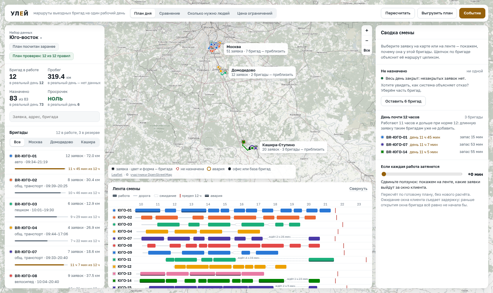
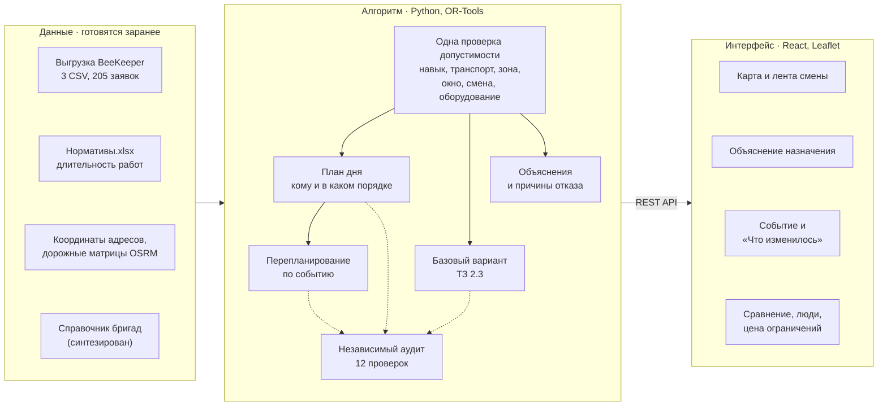

# Улей — планирование маршрутов выездных бригад

Прототип помощника диспетчера для задачи №3 ЛЦТ-2026 от «билайн бизнес»:
распределяет заявки дня между бригадами, строит маршруты по дорогам, объясняет
каждое назначение и перестраивает план после события.



**Стенд:** https://46.30.46.40 — логин `lct`, пароль `lct2026` · **Презентация:** [Google Slides](https://docs.google.com/presentation/d/1DZjdumHbSkM-GGStyJNjYPayo2SrW0t-/edit?usp=sharing&rtpof=true&sd=true)

Всё описание — в этом файле: [устройство и стек](#как-это-устроено) · [функции для бизнеса](#что-система-делает-для-бизнеса) · [алгоритм](#алгоритм-шаг-за-шагом) ·
[результаты](#результаты) · [запуск](#запуск) · [данные](#данные-поля-и-единицы-измерения) · [допущения](#принятые-допущения) · [ограничения](#известные-ограничения-и-сознательные-упрощения).

## Проверьте нас за пять минут

```bash
git clone https://github.com/cvetkov-es/Hive.git && cd Hive
python3 run.py          # на Windows: py run.py
```

Нужен только Python 3.10 или новее; команда одна для Windows, macOS и Linux.
Скрипт сам создаёт окружение `.venv`, ставит зависимости (один раз, нужна сеть),
поднимает сервис на http://127.0.0.1:8000, печатает самопроверку и открывает
браузер. Docker и ручной запуск — в разделе [Запуск](#запуск).

| Вопрос из ТЗ, раздел 8.1 | Где проверить |
|---|---|
| «Все ли обязательные ограничения реально проверяются алгоритмом?» | `(cd backend && ../.venv/bin/python -m app.cli audit --region Юго-восток)` — 20 секунд: план считается заново, и независимый аудитор проверяет его по каждому правилу, не заглядывая в код решателя |
| «Можно ли понять результат без изучения кода?» | Экран «План дня» → клик по любой заявке на карте → панель «Объяснение»: почему эта бригада и чем не подошли остальные |
| «Корректно ли решение реагирует на изменение в течение дня?» | Кнопка «Событие» → «Новая заявка», показательная авария, 15:40 → «Перепланировать» → панель «Что изменилось»: начатое заморожено, видно, что переехало |
| «Есть ли сравнение с базовым планированием по двум обязательным метрикам?» | Вкладка «Сравнение»; в README — таблица [Результаты](#результаты) |
| «Можно ли воспроизвести запуск по README?» | `python3 run.py` (Windows: `py run.py`) печатает «Самопроверка: Окружение в порядке (13 из 13)»; полный набор тестов — в разделе [Проверка](#проверка-что-всё-на-месте) |

Команды с `.venv/bin/python` — для Linux и macOS. На Windows (PowerShell) проверка правил
запускается так: `cd backend; ..\.venv\Scripts\python -m app.cli audit --region Юго-восток`;
в остальных командах вместо `.venv/bin/python` — `.venv\Scripts\python`.

## Как это устроено



- **Данные** готовятся один раз скриптами из `tools/` и лежат в репозитории:
  координаты адресов, дорожные матрицы, форма маршрутов, эталонные планы.
  Поэтому сервис работает без сети. Сеть нужна подложке карты, новому адресу
  в событии и форме новых переездов на карте — см. [Что требует сети](#что-требует-сети).
- **Алгоритм** (`backend/app/solver/`) опирается на одну проверку допустимости:
  её используют и решатель OR-Tools, и объяснения, и ручное переназначение,
  поэтому экран не может разойтись с планом. Цели по порядку: больше закрытых
  заявок, меньше бригад, меньше километров. Готовый план пересчитывает
  независимый аудитор. Подробно — [алгоритм шаг за шагом](#алгоритм-шаг-за-шагом).
- **Интерфейс** (`web/src/`) — пульт диспетчера. Всё, что он показывает, приходит
  из REST API (`backend/app/api/routes.py`), описание API — на `/docs`.

### Экран диспетчера

Шапка одна на всех вкладках: «План дня», «Сравнение», «Сколько нужно людей»,
«Цена ограничений» и кнопки «Пересчитать», «Выгрузить план», «Событие». От
1440×820 карта занимает весь экран, панели плавают поверх: слева набор данных,
плашки, метрики, поиск, фильтр зон и бригады, справа — правая панель, снизу —
лента смены; на вкладках аналитики набор данных — над страницей. На экране
меньше — компактная раскладка: набор данных и поиск в шапке, в центре карта и
под ней лента смены, где строка ленты и есть строка бригады.

Правая панель меняет содержимое. Пока ничего не выбрано — «Сводка смены»:
незакрытые заявки с причиной, кнопка «Оставить N бригад» (урезанный парк, чтобы
увидеть отказы), бригады у нормы 12 часов, ползунок «Если каждая работа
затянется». Клик по заявке — «Объяснение» (по незакрытым можно идти стрелками
«‹ ›»), по бригаде — «Маршрут бригады» с блоком «Что ограничивает маршрут»,
после события — «Что изменилось». Лента раскрашена в цвета бригад, как маршруты
на карте, и показывает задержку с ползунка.

### Стек

Всё — свободное ПО; точные версии закреплены в `requirements.txt` и `web/package.json`.

| Слой | Чем | Почему |
|---|---|---|
| Решатель | Google OR-Tools, маршрутизация с временными окнами | назван в ТЗ, раздел 3.2; окна, ёмкость, допустимые бригады и право не назначить заявку — готовые механизмы модели |
| API | Python 3.10, FastAPI, Uvicorn, Pydantic | FastAPI назван в ТЗ 3.2; схема API и `/docs` из коробки; ошибка в запросе — ответ словами, а не трассировка |
| Интерфейс | React, TypeScript, сборка Vite | React назван в ТЗ 3.2; Streamlit (там же, «для упрощённого MVP») не дал бы ленту смены как ось времени; сборка лежит в `web/dist`, Node не нужен |
| Карта | Leaflet, подложка OpenStreetMap | названы в ТЗ 3.2; Leaflet напрямую, без Folium: выбор, подсветка и обновление после события без перезагрузки |
| Дороги | OSRM | матрицы и форма маршрутов по дорогам: на встрече 16.09 про пробег ответили «По дорогам» |
| Адреса | Nominatim | координаты выгрузки — один раз заранее; новый адрес события — в работе |
| Проверка | pytest, httpx | тесты гоняют решатель по-настоящему |
| Стенд | Docker, Caddy | один контейнер с сервисом, Caddy выпускает сертификат |

**Почему OR-Tools, а не свой алгоритм.** Задача — классическая маршрутизация с
временными окнами, и у OR-Tools для неё есть всё: жёсткие окна, ёмкость,
допустимые бригады, штраф за неназначение, локальный поиск с бюджетом времени.
Проверенный решатель снимает риск «свой алгоритм нарушил окна», а доказанного
оптимума ТЗ не требует. Наше — постановка задачи и независимый аудитор.

## Что система делает для бизнеса

Пользователь один — диспетчер; инженер получает маршрут вне системы, выгрузкой.
Система предлагает выполнимый план и объясняет его, последнее слово за человеком:
ручная правка — штатный режим («Такую функциональность необходимо заложить», встреча 16.09).

| № | Функция | Где на экране · в API |
|---|---|---|
| 1 | Принять данные дня: выгрузку BeeKeeper или пару CSV формата ТЗ 2.4 | «Набор данных» · `GET /api/regions`; CLI `--from-spec` |
| 2 | Построить план дня: кто, к кому, в каком порядке, во сколько приедет и начнёт, сколько проедет | «План дня» · `POST /api/plan` |
| 3 | Показать маршруты на карте по дорогам и день каждой бригады на ленте смены | карта, лента смены · `GET /api/geometry/{plan}` |
| 4 | Объяснить назначение: почему эта бригада, кто ещё рассматривался и почему не подошёл | «Объяснение», «Все проверки» · `GET /api/explain/{plan}/{job}` |
| 5 | Объяснить маршрут бригады целиком, а для бригады без заявок — почему она в резерве | «Маршрут бригады» · `GET /api/explain_route/{plan}/{engineer}` |
| 6 | По каждой незакрытой заявке — причина и посчитанное средство: кто её возьмёт и что для этого изменить | «Сводка смены» → «Не назначено» |
| 7 | Перестроить план по событию: новая заявка, отмена, бригада выбыла — и показать разницу | «Событие» → «Что изменилось» · `POST /api/event` |
| 8 | Дать переназначить заявку вручную с ценой по каждой бригаде парка | «Переназначить» · `POST /api/validate_move`, `POST /api/move` |
| 9 | Посчитать обязательные метрики и сравнить с базовым вариантом ТЗ 2.3 и реальным днём | метрики плана, «Сравнение» · `GET /api/compare`, `GET /api/convergence` |
| 10 | Ответить, сколько бригад нужно на самом деле | «Сколько нужно людей» · `GET /api/summary` |
| 11 | Показать, во что обходится каждое ограничение | «Цена ограничений» · `GET /api/sensitivity` |
| 12 | Предупредить о риске: какие заявки выйдут за окно, если каждая работа затянется | «Сводка смены», лента смены |
| 13 | Выгрузить план: по бригаде, по заявке с причиной отказа, итог по плану | «Выгрузить план» · `GET /api/export/{plan}` |
| 14 | Доказать, что плану можно верить: независимый аудит и самопроверка окружения | плашки рядом с метриками · `GET /api/audit/{plan}`, `GET /api/health` |

**Бизнес-правила.** Окно — обязательство перед клиентом **начать** работу в
условленное время (встреча 16.09), опоздание в плане не допускается. При нехватке
ресурса: авария → подключение → ремонт и дозаказ (разъяснения экспертов, 19.09).
Навык заявки есть у бригады; если в заявке указан транспорт, у бригады именно он
(ТЗ 2.2). Бригада работает в своей зоне — Москва, Домодедово, Кашира со Ступино
(наше решение, см. [допущения](#принятые-допущения)). Работа укладывается в
смену, день бригады не длиннее 12 часов. Оборудование выдаётся утром на весь
день. Пробег — по дорогам. Начатое и визит, к которому бригада уже едет, при
перепланировании не отбираются.

## Алгоритм шаг за шагом

Путь одного рабочего дня: от выгрузки до плана, события и ручной правки.

**Шаг 1. Собрать задачу участка.** Навык и длительность визита — по паре «Тип
заявки BK» × «Тип заявки HD» из `Нормативы.xlsx` (визит = норматив − 20 + 10
минут), зона — по адресу. Расстояния и время — из дорожной матрицы OSRM,
посчитанной заранее; бригады — из справочника `data/fleet/`.

**Шаг 2. Отсеять заведомо неподходящих.** Для каждой пары «заявка × бригада»
одна функция (`feasibility.py`) проверяет по порядку: навык → транспорт → зона →
окно пересекается со сменой и работа успевает закончиться до её конца. Первое
нарушение и есть причина отказа. Оборудование и время зависят от маршрута и
проверяются дальше.

**Шаг 3. Поставить задачу решателю** (`engine.py`). Каждая бригада стартует со
своей базы, возвращаться не нужно. Жёстко: начало работ — внутри окна; работа
заканчивается внутри смены 09:30–23:30, а день от выезда до конца последней
работы не длиннее 12 часов; навык, транспорт и зона — список допустимых бригад у
заявки; оборудование — дневной запас, расходуемый по маршруту. Время у бригады
своё по типу транспорта, километры — одни на всех.

**Шаг 4. Цели по порядку.** Одна целевая функция в метрах, слои разнесены по
масштабу так, что нижний не перевесит верхний (`weights.py`, `tests/test_weights.py`):
1. закрыть больше заявок — брошенная заявка дороже всего парка с пробегом, а её
   штраф умножен на приоритет: авария ×4, подключение ×2, ремонт и дозаказ ×1;
2. задействовать меньше бригад — каждая дороже всего пробега плана;
3. проехать меньше километров. Авария с окном на сутки ещё и тянется к началу дня.

**Шаг 5. Искать.** Первое решение — жадно по самой дешёвой дуге, дальше
управляемый локальный поиск, пока не кончится время: план дня — 600 с заранее,
«Пересчитать» — 20 с. Заявка, которую поставить не удалось, остаётся
неназначенной с причиной, а не делает задачу неразрешимой.

**Шаг 6. Пересчитать расписание** (`metrics.py`). Одна функция заново проходит
маршрут по матрице: выезд, прибытие, ожидание, начало, окончание, километры.
Выезд рассчитан так, чтобы приехать к открытию первого окна, а не ждать у офиса.

**Шаг 7. Проверить независимо** (`audit.py`). Аудитор не импортирует ни
решатель, ни функцию допустимости (это проверяет тест) и сверяет 12 правил:
заявка назначена не больше раза; навык, транспорт, оборудование; начало не
раньше и не позже окна; приезд и километры сходятся с матрицей; работа внутри
смены; день не длиннее нормы; после события ничего в прошлом; бригада в своей
зоне. Итог — плашка «План проверен: 12 из 12 правил»; так же проверяются
базовый вариант и планы после события и ручной правки.

**Шаг 8. Объяснить** (`explain.py`). По заявке — кто взял и до трёх причин, до
трёх других бригад с причиной «почему не они», за кнопкой «Все проверки» — весь
парк. Для незакрытой — причина и посчитанные средства: какая бригада возьмёт её
при другом времени визита, если довезти оборудование, если добавить бригаду в зону.

**Шаг 9. Событие дня** (`replan.py`): момент и одно событие — новая заявка,
отмена заявки или бригада выбыла.
- Заморожено всё, к чему бригада приступила до события, и визит, к которому она
  уже едет и не успела бы, выехав заново. Остальное планируется от адреса
  последнего замороженного визита или от базы, не раньше события; 12 часов —
  от утреннего выезда.
- Обычная новая заявка встаёт в самое дешёвое свободное место (сначала без новой
  бригады, потом по километрам), остальной план не трогается; места нет —
  остаётся неназначенной с причиной.
- Авария (навык «Аварийные работы» или приоритет «Срочная»), отмена и выбытие
  перепланируют остаток дня решателем за 10 с. Старт поиска — прежний план,
  смена исполнителя у назначенной заявки стоит около 30 км, бригада с
  замороженными визитами за выход повторно не платит.
- Показательная авария получает окно в два часа от события. Заявка, чьё окно
  закрылось до события, уходит в неназначенные с этой причиной. Начатое
  отменить нельзя, события идут только вперёд по времени.

Итог — панель «Что изменилось»: что заморожено, кто сменил исполнителя, что
вытеснено и почему, как изменились метрики.

**Шаг 10. Ручная правка.** «Переназначить» показывает по каждой бригаде парка,
возьмёт ли она заявку и во сколько километров, неподходящие — с причиной. Заявка
встаёт в самое дешёвое место маршрута, дни обеих бригад пересчитываются, план
проходит тот же аудит. Начатое и то, к чему бригада уже едет, не переносится.

**Правила на всех шагах:** навык, транспорт, зона, окно, смена, 12 часов и
оборудование — условия допустимости, а не слагаемые цели; цели строго по
порядку: заявки → бригады → километры; прошлое не переписывается; пробег — по
дорогам; расстояние по прямой помечено плашкой и пунктиром.

## Результаты

Три участка, один день, 205 заявок. Наш план против базового варианта из ТЗ,
раздел 2.3: тот же парк, те же ограничения, тот же аудит. Базовый вариант
буквальный: заявки в порядке строк файла получает первая подходящая бригада в
порядке справочника, заявка ставится в конец её маршрута (`backend/app/solver/baseline.py`).

<!-- ЧИСЛА:результаты -->
Посчитано `tools/build_reference.py`, бюджет решателя 600 с на регион, машина: Intel64 Family 6 Model 165 Stepping 5, GenuineIntel.

| Регион | Наш план | Базовый вариант ТЗ 2.3 |
|---|---|---|
| Восток | 8 бригад, 205.3 км, 66/66 заявок | 12 бригад, 297.3 км, 45/66 |
| Юго-восток | 12 бригад, 319.4 км, 83/83 заявок | 15 бригад, 406.8 км, 63/83 |
| Югоцентр | 7 бригад, 190.7 км, 56/56 заявок | 11 бригад, 269.7 км, 40/56 |
| **Всего** | **27 бригад, 715.4 км, 205/205** | 38 бригад, 973.8 км, 148/205 |

Против базового варианта на том же парке: людей меньше на 29%, пробег меньше на 27%, и базовый не закрывает 57 заявок из 205.

Против контрольного дня: бригад 27 против 35 (по участкам 8 / 12 / 7 против 12 / 12 / 11); в нашем плане опозданий 0, в контрольном дне просрочено 10 заявок.
<!-- /ЧИСЛА:результаты -->

Контрольный день — выгрузка организаторов о том, как участки отработали на
самом деле; на экране он называется «Реальный день». По словам организаторов,
это «один из реальных дней сентября», дата в файлах обезличена. Пробег
контрольного дня невычислим: в файле есть бригада, но нет порядка объезда. В расчёте планов контрольный день не участвует — только в
сравнении (указание постановщика от 16.09).

### Сколько бригад нужно на самом деле

<!-- ЧИСЛА:кривая -->
Все заявки закрывает ровно столько бригад, сколько работает в основном плане: на таком штате он проходит аудит. Бригадой меньше — заявки остаются без исполнителя. Штат урезали так: первыми уходят бригады без заявок, потом наименее загруженные; зона не остаётся без бригады. Меньшие штаты считались по 180 с.

| Регион | Штат | Работают | Закрыто заявок | Без бригады | Пробег |
|---|---|---|---|---|---|
| Восток | 6 | 6 | 54 | 12 | 179.3 км |
| Восток | 7 | 7 | 60 | 6 | 189.1 км |
| Восток | 8 | 8 | 66 | 0 | 205.3 км (основной план) |
| Восток | 12 | 8 | 66 | 0 | 205.3 км (основной план) |
| Юго-восток | 10 | 10 | 75 | 8 | 277.8 км |
| Юго-восток | 11 | 11 | 79 | 4 | 286.5 км |
| Юго-восток | 12 | 12 | 83 | 0 | 319.4 км (основной план) |
| Юго-восток | 15 | 12 | 83 | 0 | 319.4 км (основной план) |
| Югоцентр | 5 | 5 | 46 | 10 | 151.5 км |
| Югоцентр | 6 | 6 | 53 | 3 | 191.0 км |
| Югоцентр | 7 | 7 | 56 | 0 | 190.7 км (основной план) |
| Югоцентр | 11 | 7 | 56 | 0 | 190.7 км (основной план) |
<!-- /ЧИСЛА:кривая -->

### Сколько считать: чем дольше поиск, тем лучше план

<!-- ЧИСЛА:время -->
Решатель ищет, пока не кончится время, и сообщает о каждом найденном плане. Поэтому хватает одного прогона на участок: 600 с, участки параллельно. Машина: Intel64 Family 6 Model 165 Stepping 5, GenuineIntel. В строке — лучший план, найденный к этому моменту, сумма по трём участкам.

| Время счёта | Бригад | Пробег | Закрыто заявок | Где в интерфейсе |
|---|---|---|---|---|
| 1 с | 30 | 706.8 км | 205 из 205 |  |
| 2 с | 30 | 675.3 км | 205 из 205 |  |
| 5 с | 30 | 651.0 км | 205 из 205 |  |
| 10 с | 29 | 682.8 км | 205 из 205 | событие дня |
| 20 с | 29 | 682.8 км | 205 из 205 | кнопка «Пересчитать» |
| 30 с | 29 | 682.8 км | 205 из 205 |  |
| 60 с | 28 | 680.8 км | 205 из 205 |  |
| 120 с | 28 | 673.0 км | 205 из 205 |  |
| 300 с | 28 | 670.7 км | 205 из 205 |  |
| 600 с | 27 | 715.4 км | 205 из 205 | план, посчитанный заранее |
| базовый вариант ТЗ 2.3 | 38 | 973.8 км | 148 из 205 | |

Диспетчер десять минут не ждёт: план дня считается заранее, перестройка после события — 10 с, «Пересчитать» — 20 с.
<!-- /ЧИСЛА:время -->

### Цена каждого ограничения

Парк мы смоделировали сами — справочника исполнителей в данных нет. Проверить
наши числа снаружи невозможно, поэтому показываем, сколько стоит каждое правило:
снимаем его и считаем день заново.

<!-- ЧИСЛА:чувствительность -->
Первая строка — основной план. Остальные — тот же день с одним изменённым правилом, расчёт по 180 с; всё, кроме названного, неизменно. Если правило только ослаблено, основной план остаётся допустимым, и в строке — лучшее из двух: нового расчёта и основного плана.

Строка «Как есть» совпадает с основным результатом во всех регионах.

Читается так: если при снятом ограничении бригад становится **меньше** — значит это ограничение стоит нам разницы в людях. Если больше километров — ограничение экономит пробег.

**Восток**

| Сценарий | Бригад | Пробег | Заявок |
|---|---|---|---|
| _Как есть_ | **8** | **205.3 км** | 66/66 |
| _снимаем ограничение_ | | | |
| Без квалификаций | 8 (=) | 205.3 км (=) | 66/66 |
| Без требований к транспорту | 8 (=) | 187.5 км (-18) | 66/66 |
| Без лимита оборудования | 8 (=) | 205.3 км (=) | 66/66 |
| Без зон и без местных баз | 8 (=) | 205.3 км (=) | 66/66 |
| Без запрета зон, базы на месте | 8 (=) | 205.3 км (=) | 66/66 |
| Опоздание до 30 минут * | 8 (=) | 203.3 км (-2) | 66/66 |
| _меняем допущение_ | | | |
| Рабочий день 10 часов | 10 (+2) | 220.2 км (+15) | 65/66 ⚠ |
| Рабочий день 13 часов | 8 (=) | 203.5 км (-2) | 66/66 |
| Без надбавки на подход | 8 (=) | 181.5 км (-24) | 66/66 |

**Юго-восток**

| Сценарий | Бригад | Пробег | Заявок |
|---|---|---|---|
| _Как есть_ | **12** | **319.4 км** | 83/83 |
| _снимаем ограничение_ | | | |
| Без квалификаций | 12 (=) | 307.3 км (-12) | 83/83 |
| Без требований к транспорту | 12 (=) | 254.8 км (-65) | 83/83 |
| Без лимита оборудования | 12 (=) | 289.4 км (-30) | 83/83 |
| Без зон и без местных баз | 12 (=) | 617.7 км (+298) | 83/83 |
| Без запрета зон, базы на месте | 11 (-1) | 362.3 км (+43) | 83/83 |
| Опоздание до 30 минут * | 12 (=) | 306.2 км (-13) | 83/83 |
| _меняем допущение_ | | | |
| Рабочий день 10 часов | 13 (+1) | 315.7 км (-4) | 82/83 ⚠ |
| Рабочий день 13 часов | 12 (=) | 306.6 км (-13) | 83/83 |
| Без надбавки на подход | 11 (-1) | 302.6 км (-17) | 83/83 |

**Югоцентр**

| Сценарий | Бригад | Пробег | Заявок |
|---|---|---|---|
| _Как есть_ | **7** | **190.7 км** | 56/56 |
| _снимаем ограничение_ | | | |
| Без квалификаций | 7 (=) | 170.9 км (-20) | 56/56 |
| Без требований к транспорту | 7 (=) | 163.7 км (-27) | 56/56 |
| Без лимита оборудования | 6 (-1) | 214.2 км (+24) | 56/56 |
| Без зон и без местных баз | 7 (=) | 190.7 км (=) | 56/56 |
| Без запрета зон, базы на месте | 7 (=) | 190.7 км (=) | 56/56 |
| Опоздание до 30 минут * | 7 (=) | 190.7 км (=) | 56/56 |
| _меняем допущение_ | | | |
| Рабочий день 10 часов | 9 (+2) | 179.6 км (-11) | 56/56 |
| Рабочий день 13 часов | 7 (=) | 185.2 км (-6) | 56/56 |
| Без надбавки на подход | 7 (=) | 157.7 км (-33) | 56/56 |

_«Без зон и без местных баз» — все бригады выезжают из московского офиса, зоны не действуют._
_«Без запрета зон, базы на месте» — бригада может взять заявку в чужой зоне, но выезжает со своей базы._
_\* Мягкие окна меняют постановку задачи, а не только ограничение: километры этой строки с остальными несопоставимы._
_⚠ В этом сценарии закрыты не все заявки._
<!-- /ЧИСЛА:чувствительность -->

## Запуск

Нужен Python 3.10 или новее. Node не нужен: собранный интерфейс (`web/dist`)
лежит в репозитории. Проверено на Ubuntu 22.04 с Python 3.10.

### Одной командой

```bash
python3 run.py          # порт 8000; python3 run.py 8010 — другой порт
```

На Windows — `py run.py`; `./run.sh` делает то же самое. `run.py` написан на
Python без сторонних пакетов и от bash не зависит. `NO_BROWSER=1 python3 run.py`
не открывает браузер (PowerShell: `$env:NO_BROWSER=1; py run.py`). Скрипт не
падает там, где можно предупредить: если чего-то не хватает, он говорит об этом
строкой, а сервис поднимается с тем, что есть.

### Или руками

```bash
python3 -m venv .venv && . .venv/bin/activate
pip install -r requirements.txt
cd backend && python -m uvicorn app.main:app --port 8000
```

Открыть http://127.0.0.1:8000 — бэкенд сам отдаёт собранный интерфейс. Описание
API: http://127.0.0.1:8000/docs (OpenAPI; страница подгружает оформление из
интернета, сама схема без сети — `/openapi.json`).

### Windows (PowerShell) руками

```powershell
py -3 -m venv .venv
.venv\Scripts\python -m pip install -r requirements.txt
cd backend
..\.venv\Scripts\python -m uvicorn app.main:app --port 8000
```

Эти четыре команды делают то же, что `py run.py`.

### Docker

```bash
docker build -t hive .
docker run --rm -p 8000:8000 hive
```

Образ на `python:3.10-slim`, один процесс отдаёт API и интерфейс. В образ идут
код, данные, эталонные планы и собранный интерфейс; скрипты `tools/` и тесты —
нет (`.dockerignore`). Docker — для стенда, для проверки он не нужен.

### Проверка, что всё на месте

После первого запуска окружение `.venv` уже есть (на Windows вместо
`.venv/bin/python` — `.venv\Scripts\python`):

```bash
.venv/bin/python tools/check_data.py
.venv/bin/python -m pytest tests/
```

Первая команда занимает доли секунды и заканчивается строкой «КТ-1 пройдена»: все
заявки разобраны и геокодированы, дорожные матрицы согласованы с моделью, у каждой
зоны есть стартовая точка. Вторая идёт около 4 минут: набор гоняет решатель
по-настоящему, по 10 секунд на прогон.

Сервис проверяет себя и сам: `GET /api/health` — тринадцать проверок, по четыре на
регион (задача собирается, размер матрицы совпал с моделью, стартовые точки на
месте, эталонный план проходит независимый аудит) плюс геокэш. Этот отчёт
печатает `run.py`, а интерфейс показывает провал плашкой рядом с метриками плана.
Провал ничего не останавливает: работающий экран с честной плашкой полезнее пустого.

### Свои данные в формате ТЗ 2.4

```bash
(cd backend && ../.venv/bin/python -m app.cli plan --from-spec ../data/demo/Восток)
```

Каталог с парой файлов `jobs.csv` и `engineers.csv` в формате ТЗ 2.4; образец —
`data/demo/Восток`, собирается командой `tools/make_demo_dataset.py`. Для чужих
адресов дорожной матрицы нет, поэтому расстояния считаются по прямой с
коэффициентом извилистости 1.45. Загрузки файлов в интерфейсе нет.

## Как развернуть стенд

ТЗ приветствует публичный стенд (раздел 3.2), а в форме сдачи поле «Прототип» —
это «ссылка на развернутый и работающий сервис» (куратор, 22.09). Хватит одной
виртуалки с Ubuntu 22.04: 1–2 vCPU и 1–2 ГБ памяти. Решатель в одном процессе
берёт одно ядро — два расчёта разом делят его пополам, — поэтому важнее
быстрое ядро, чем много ядер.

### Docker и Caddy с сертификатом

Нужны домен с A-записью на IP сервера и свободные порты 80 и 443:

```bash
git clone https://github.com/cvetkov-es/Hive.git && cd Hive
HIVE_DOMAIN=hive.example.com docker compose up -d --build
sudo ufw allow OpenSSH && sudo ufw allow 80,443/tcp && sudo ufw enable
```

Caddy сам получает и продлевает сертификат Let's Encrypt. Без домена —
`HIVE_DOMAIN=:80`: тот же стенд по HTTP. Наружу открыт только Caddy. Улей
слушает 8000 внутри сети compose, у него файловая система только для чтения,
процесс не от root, память и процессор ограничены. Порты, опубликованные
Docker, ufw не закрывает, поэтому у сервиса `hive` в `docker-compose.yml` нет
`ports`, и добавлять их не нужно.

Что стенд выдерживает, будучи открытым в интернет:

- живых расчётов — пересчёт, урезанный парк, событие — не больше двух
  одновременно, следующему отвечают «сервер занят» словами; заранее
  посчитанные планы, объяснения и карта под этот предел не попадают;
- время счёта в запросе — не больше 30 с (`time_limit_s`; интерфейс просит не больше 20 с);
- путь из адреса не выходит за папку собранного интерфейса;
- в `runs/` хранятся последние 1000 планов, диск не заполняется;
- между запросами к геокодеру Nominatim, как и между запросами к OSRM, — не
  меньше секунды (`backend/app/geo/polite.py`): так требуют правила публичных сервисов.

### Без Docker

Так развёрнут стенд жюри: сервис слушает только 127.0.0.1, наружу его отдаёт
nginx с простым паролем — от роботов, а не от людей, поэтому пароль и
написан в начале README.

```bash
sudo apt install -y python3-venv nginx
sudo git clone https://github.com/cvetkov-es/Hive.git /opt/Hive && sudo chown -R $USER /opt/Hive
cd /opt/Hive && NO_BROWSER=1 python3 run.py 8000   # окружение и зависимости; после «Готово» — Ctrl+C
```

Сервис — через systemd, чтобы поднимался сам после сбоя и перезагрузки,
`/etc/systemd/system/hive.service` (`User` — тот, кто клонировал):

```ini
[Unit]
Description=Hive
After=network-online.target

[Service]
User=ubuntu
WorkingDirectory=/opt/Hive/backend
ExecStart=/opt/Hive/.venv/bin/python -m uvicorn app.main:app --host 127.0.0.1 --port 8000
Restart=always

[Install]
WantedBy=multi-user.target
```

```bash
sudo systemctl enable --now hive
printf 'lct:%s\n' "$(openssl passwd -apr1 lct2026)" | sudo tee /etc/nginx/.htpasswd
```

`/etc/nginx/sites-available/hive`, затем
`sudo ln -s /etc/nginx/sites-available/hive /etc/nginx/sites-enabled/ && sudo rm /etc/nginx/sites-enabled/default && sudo nginx -t && sudo systemctl reload nginx`:

```nginx
server {
    listen 80 default_server;
    client_max_body_size 1m;
    auth_basic "Hive";
    auth_basic_user_file /etc/nginx/.htpasswd;
    location / {
        proxy_pass http://127.0.0.1:8000;
        proxy_read_timeout 120s;    # живой пересчёт идёт до минуты
    }
}
```

## Подготовка данных: что и зачем считается заранее

Всё ниже уже посчитано и лежит в репозитории. Пересчитывать нужно, только если
меняются исходные данные или модель. Команды — внутри окружения:
`. .venv/bin/activate`.

| Шаг | Что делает | Когда запускать |
|---|---|---|
| `python tools/build_matrix.py` | дорожные матрицы OSRM; `--region` — один регион | при смене адресов или стартовых точек |
| `python tools/build_geometry.py --all` | форма маршрутов для карты | после смены эталонных планов |
| `python tools/gen_fleet.py` | справочник бригад, детерминированно по зерну | при смене модели парка |
| `python tools/build_reference.py --seconds 600 --curve --curve-seconds 180` | эталонные планы и кривая «парк → результат»; с `--region` дополняет `artifacts/summary.json`, а не перезаписывает | при смене модели |
| `python tools/sensitivity.py --seconds 600` | цена каждого ограничения, все регионы сразу | при смене модели |
| `python tools/convergence.py` | кривая «время счёта → результат»: один прогон 600 с на регион | на той же машине, что эталонные планы, после их пересчёта |
| `python tools/make_numbers.py` | подставляет числа в README | после любого из предыдущих |

Скрипты расчёта параллельные: решатель однопоточный, поэтому прогоны идут
разными процессами. Флаг `--jobs` задаёт их число, по умолчанию — число ядер
минус одно.

Числа результатов в README руками не пишутся — их подставляет
`tools/make_numbers.py` между маркерами `<!-- ЧИСЛА:… -->`. С флагом `--check`
он ничего не меняет и возвращает ненулевой код, если числа разошлись с
результатами расчёта (и печатает разницу) или в README остались маркеры
«ЗАПОЛНИТЬ» и «TODO»: это напоминание перед сдачей.

### Что требует сети

**Сервис в сеть не ходит** — за тремя исключениями. Первое: интерфейс
загружает подложку карты с `tile.openstreetmap.org`. Без интернета карта будет
серой, но точки заявок, маршруты, метрики, объяснения и перепланирование работают
полностью: всё это считается из данных в репозитории. Форма маршрутов по улицам
для планов, посчитанных заранее, тоже лежит в репозитории (`data/geo/routes.json`),
её посчитал тот же OSRM, что и дорожные матрицы.

Второе: диспетчер вводит адрес, которого нет в выгрузке. Координаты ищутся в
жёстком порядке: кэш, память сеанса, один запрос к геокодеру. Без сети система
отказывает словами — «укажите координаты явно», — а не ставит точку наугад:
дальше по этой точке считается пробег, и выдумка в этом месте дороже отказа.
Дороги до новой точки берутся одним запросом `/table` к тому же OSRM, что считал
матрицы: расстояние и время от неё до каждой точки участка и обратно
(`backend/app/geo/roads.py`). Не ответил OSRM или точка дальше километра от
дороги — переезды к ней достраиваются по прямой с замеренным коэффициентом
извилистости 1.45, и рядом с метриками плана загорается плашка «1 адрес вне
таблицы расстояний».

Третье: после «Пересчитать», события или ручного переназначения в плане
появляются переезды, формы которых в сохранённых картах нет. Карта сразу рисует
их прямой пунктиром и тут же спрашивает форму у того же OSRM
(`GET /api/geometry/{plan}?live=1`) — один запрос `/route` на бригаду, по запросу
в секунду, ответ запоминается (`backend/app/geo/geometry.py`).
Без сети пунктир остаётся. Километры и время при этом всё равно по дорогам, из
матрицы: прямая — только рисунок.

Скрипты подготовки данных сеть используют — это их работа, сервис их не
вызывает.

## Данные, поля и единицы измерения

### Что за набор

Исходные данные — выгрузка BeeKeeper по трём участкам: 205 заявок одного дня и
контрольный день для сравнения. В файлах стоит дата 17.08.2026; по словам
экспертов, контрольная выборка — «один из реальных дней сентября», то есть дата
обезличена. Файлы в кодировке cp1251, разделитель «;», окончания строк CRLF; адрес
офиса лежит отдельной строкой под таблицей. Справочника исполнителей в данных
нет — парк синтезирован детерминированно (`tools/gen_fleet.py`), это прямо
разрешено разъяснениями экспертов от 19.09.

Тот же набор в формате ТЗ 2.4 собирается командой
`python tools/make_demo_dataset.py`: `jobs.csv`, `engineers.csv`, `events.json`
и пример результата `plan.example.json`. Он нужен, чтобы формат можно было
открыть, прочитать и подать обратно на вход, не разбираясь в выгрузке.

### Состав заявок против ориентира экспертов

<!-- ЧИСЛА:типы-работ -->
Посчитано `tools/make_numbers.py` по файлам `data/raw/* Синтетические данные.csv`.

| Тип работ | Восток | Юго-восток | Югоцентр | Всего | Ориентир экспертов |
|---|---|---|---|---|---|
| Локальные | 26 (39%) | 31 (37%) | 26 (46%) | 83 (40%) | 40% |
| Подключения | 31 (47%) | 36 (43%) | 28 (50%) | 95 (46%) | 40% |
| Аварии | 3 (5%) | 12 (14%) | 0 (0%) | 15 (7%) | 10% |
| Дозаказы | 6 (9%) | 4 (5%) | 2 (4%) | 12 (6%) | 10% |
| Заявок | 66 | 83 | 56 | 205 | |

_Тип — по полю «Тип заявки BK». «Глобальная проблема» считается аварией, только если в поле HD стоит «Авария», — так же решает модель; остальные 6 — обследование сети, то есть локальные работы._
<!-- /ЧИСЛА:типы-работ -->

Ориентир — из разъяснений экспертов от 19.09, пункт 11: «Если команда
самостоятельно синтезирует данные, можно использовать примерно следующее
распределение типов заявок: 40% локальных заявок, 40% подключений, 10% аварий и
10% дозаказов». Мы данные не синтезировали: это выгрузка организаторов, и доли в
ней свои. Аварий меньше ориентира, а в Югоцентре их нет вовсе, поэтому аварийный
сценарий показываем на Юго-востоке — там их больше всего.

### Поля

| Сущность | Поля |
|---|---|
| Заявка | ID, адрес (или широта и долгота), длительность в минутах, начало и конец временного окна, приоритет, требуемый навык, требуемый тип транспорта (если ограничение есть), требуемое оборудование |
| Исполнитель | ID и имя, стартовая точка, начало и конец смены, от одного до трёх навыков, тип транспорта, запас оборудования на день |
| Результат | по исполнителю: упорядоченные заявки, время прибытия, начала и окончания работ, пробег; по заявке: исполнитель либо статус «не назначена» с причиной |

### Единицы измерения

| Величина | Единица | Замечание |
|---|---|---|
| Время суток | ЧЧ:ММ, московское | внутри модели — минуты от полуночи |
| Длительность работы, дорога, ожидание, опоздание | минуты | целые |
| Пробег на экране и в выгрузке | километры | одна десятая |
| Расстояния в дорожной матрице | метры | целые, из OSRM |
| Время в матрице | секунды свободного потока | делится на 0.75 для автомобиля |
| Координаты | градусы, WGS 84 | шесть знаков после запятой |

### Справочники

| Справочник | Значения |
|---|---|
| Навык | Локальные работы · Работы на подключение и дозаказы · Аварийные работы |
| Транспорт | Автомобиль · Общественный транспорт · Велосипед · Пешеход |
| Оборудование | Роутер · ТВ-приставка · Умная колонка |
| Приоритет (наружу) | Обычная · Срочная; внутри три уровня: авария → подключение → ремонт и дозаказ |
| Окна | шесть двухчасовых слотов с 10:00 до 22:00 плюс суточное окно аварии |

Длительность визита берётся из официальной таблицы `Нормативы.xlsx` по паре
«Тип заявки BK» × «Тип заявки HD»: подключение 90 мин, авария 100, дозаказ 40,
локальная заявка 50. Из норматива вычитаются заложенные в него 20 минут дороги
и прибавляются 10 минут на подход и парковку — обе поправки разобраны ниже.

## Принятые допущения

Каждое допущение — сознательное решение, а не умолчание. Где правило уточнил
куратор задачи в чате 20–22.09, рядом — его цитата с датой и что мы сделали.

**Длительность визита.** В базовый норматив из `Нормативы.xlsx` уже включены
20 минут дороги (колонка «Дорога до клиента/ТКД»). Мы их вычитаем, а дорогу берём
из дорожной матрицы. Куратор 21.09 подтвердил ровно это: «при распределение
20 минут меняется на реально рассчитаное время в дорогу». Сверху мы прибавляем
10 минут на подход и парковку — это наша добавка: на встрече 16.09 парковку,
пропускной режим и подъём к квартире отнесли ко «времени на дорогу» (строки
149–153), а в дорожной матрице их нет. Итог `визит = норматив − 20 + 10`:
подключение 80 мин, авария 90, локальная заявка 40, дозаказ 30. Цена добавки —
строка «Без надбавки на подход» в таблице выше. Без вычитания день бригады
раздувается на 1120–1660 минут по региону — дорога считается дважды.

**Временные окна.** Окно в выгрузке — время, в которое бригада должна
**прибыть**. Приехать раньше можно (ждём открытия окна), начинать работу раньше
нельзя. Опоздание в плане не допускается: ТЗ относит попадание начала работ в окно
к обязательным ограничениям, а куратор 22.09 подтвердил: «В текущем процессе
временные окна фиксированы». Заявка, которая не помещается, уходит в
неназначенные с причиной. Он же разрешил «экспериментировать с изменением
временных окон» — такой эксперимент в таблице выше: строка «Опоздание до 30 минут».

**Рабочий день.** Окна покрывают 10:00–22:00 — это не рабочий день. Одна смена с
широким окном доступности 09:30–23:30 и ограничением длительности дня в 12 часов;
когда бригаде выехать, решает алгоритм. Деления парка на смены нет: в контрольном
дне из 35 бригад позже 10:00 выезжают пять, и лишь у двух из них реальная
нагрузка. 12 часов — наш нормативный выбор, а не измерение: фактический день
бригады с последним окном 20:00–22:00 ближе к 13.5 часам. Работа обязана
закончиться внутри смены.

**Аварии.** Норматив 100 минут (не «весь день», несмотря на окно 00:01–23:59).
Авария определяется полем HD, а не BK: в Востоке из 8 «Глобальных проблем»
только 3 являются авариями, остальные — «Информация». Авария, поступившая в
течение дня, получает окно в два часа от момента события: куратор 22.09 назвал
«ориентировочное время реакции 1–2 часа».

**Зоны обслуживания.** Юго-восток разбит на зоны: Москва (51 заявка),
Кашира и Ступино (20), Домодедово (12). У удалённых зон свои стартовые точки —
это разрешено разъяснениями экспертов от 19.09 (пункт 13). Бригада работает в
своей зоне — это наше решение. Куратор 22.09 уточнил: «Специально запрещать
отправку московских бригад в удалённые города не нужно», нежелательно только,
чтобы бригада «кочевала» между удалённым городом и Москвой. Мы проверили прямо,
в нескольких прогонах по 600 с. Без запрета, при сохранённых базах, решатель
иногда находит план на несколько бригад меньше — но только ценой сотен лишних
километров: бригады начинают ездить между областью и Москвой, вплоть до маршрутов
вида Домодедово → Москва → Домодедово, то есть ровно то кочевание, которое
куратор назвал нежелательным. Вариант «не больше одной смены зоны за день» мы
тоже проверили: бригад не меньше, километров больше. Поэтому запрет оставлен
сознательно, а его цену показывает строка «Без запрета зон, базы на месте» в
таблице выше. В контрольном дне ни одна бригада тоже не смешивает Москву с
областью. Строка «Без зон и без местных баз» мерит другое: что будет, если
убрать местные базы и выпускать все бригады из московского офиса.

**Время в пути.** Одна дорожная матрица OSRM, четыре профиля. Пробег одинаков
для всех типов транспорта — это обязательная метрика, она не должна зависеть от
состава парка. Транспорт влияет только на минуты: авто по времени OSRM с
понижающим коэффициентом скорости 0.75, велосипед 13 км/ч, пешеход 4.5 км/ч,
общественный транспорт 8 мин подхода + 18 км/ч. Прогноз пробок сознательно не
строится — планирование ведётся заранее.

**Событие дня.** Куратор 22.09: новая обычная заявка «не должна полностью
перестраивать уже сформированный план», «аварийная заявка может привести к
перепланированию оставшейся части рабочего дня», «инженер не должен бросать уже
начатую работу». Так и сделано — см. [шаг 9 алгоритма](#алгоритм-шаг-за-шагом).

**Оборудование.** Запас каждого вида — полтора спроса зоны, поровну по её
бригадам без учёта транспорта (`tools/gen_fleet.py`). Ориентир куратора 22.09
для пешего — «примерно 1–2 единицы оборудования в рюкзаке, но это именно
допущение для моделирования» — мы пока не применили. Цена самого лимита —
строка «Без лимита оборудования» в таблице выше.

## Структура

```
tools/      подготовка данных заранее: адреса, дорожные матрицы, справочник
            бригад, эталонные планы, числа для README. Сервис их не вызывает.
data/       исходные CSV, координаты адресов, дорожные матрицы, справочник бригад
artifacts/  результаты расчёта: эталонные планы, кривая, цена ограничений
backend/    модель, решатель, аудит, объяснения, REST API
web/        интерфейс диспетчера; собранная версия — web/dist
tests/      тесты
```

## Известные ограничения и сознательные упрощения

- Обеденные перерывы не моделируются: на встрече 16.09 это назвали «абсолютно
  не обязательно» (строка 241).
- Общественный транспорт считается усреднённой скоростью, реальные расписания не
  используются. Разъяснения экспертов это допускают: «усреднённое время или
  скорость» (пункт 14).
- Суточный путь пешей и велосипедной бригады отдельно не ограничен: в плане
  встречаются пешие маршруты длиннее, чем разумно пройти за день.
- План может поставить приезд на последнюю минуту окна: запаса на задержку в
  дороге нет.
- Оборудование — запас, выдаваемый в офисе на весь день; передача между
  бригадами не моделируется. Запас раскладывается поровну и не зависит от
  транспорта (см. [допущения](#принятые-допущения)).
- Точного положения бригады на дороге нет. Визит, к которому она уже едет и
  который не отложить, при событии заморожен (на ленте помечен). Бригаду, которая
  успевает к клиенту и после события, мы считаем стоящей там, где она закончила
  последнюю работу, или на базе, хотя она, возможно, уже в пути.
- Свои данные подаются только из командной строки, загрузки файла в интерфейсе нет.
- Сознательно вне прототипа: несколько дней подряд (весь набор — один день),
  прогноз пробок, вход для инженера, авторизация. События вводятся по одному.
  Языковых моделей нет: постановщик 16.09 ответил «Можно, но не обязательно» —
  это «не даст никакого преимущества по сравнению с простыми алгоритмами
  транспортной задачи».
- На карте Юго-востока одна область с автомасштабом, а не отдельные врезки для
  Москвы и Подмосковья: от Москвы до Каширы 90 км, поэтому московская группа
  точек на общем виде плотная. Выбор бригады приближает её маршрут.
- Цвет метки кодирует бригаду, но при 15 бригадах цвета перестают надёжно
  различаться. Поэтому бригада кодируется ещё и формой метки, а при выборе
  маршруты остальных гасятся.

## Идеи развития

- Несколько дней подряд и перенос заявок между днями.
- Время в пути по истории выездов вместо средней скорости; для бригад без
  машины — выбор между ходьбой и общественным транспортом по реальному
  расписанию. Эксперты назвали это «дополнительный интерес при оценке»
  (разъяснения от 19.09, пункт 14).
- Зона как штраф за переезд между зонами вместо запрета: куратор 22.09 разрешил
  пересекать зоны, если маршрут остаётся рациональным.
- Запас до конца окна и суточный предел пути для пеших и велосипедистов как
  настраиваемые правила — с ценой в таблице ограничений, как у остальных.
- Нормативы, обученные на фактической длительности работ.
- Экран инженера: маршрут, статусы заявки, фактическое закрытие.
- Загрузка своих CSV и JSON прямо в интерфейсе.
- Врезки на карте для Москвы и области, кластеризация точек.
- Вёрстка под телефон.

## Команда и материалы

- **Команда:** Евгений Цветков (капитан, разработчик), Екатерина Цветкова (дизайнер).
- **Стенд:** https://46.30.46.40 — логин `lct`, пароль `lct2026`.
- **Презентация:** [Google Slides](https://docs.google.com/presentation/d/1DZjdumHbSkM-GGStyJNjYPayo2SrW0t-/edit?usp=sharing&rtpof=true&sd=true).
- **Репозиторий:** https://github.com/cvetkov-es/Hive
